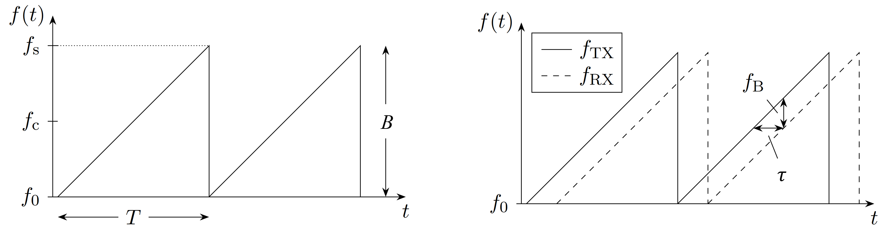

# Task list :heavy_check_mark:

These tasks are non-strictly chronologically sorted  (top->first, bottom->last).

Check them off if they are finished.

## General things

- Communication across the different groups is needed for a functioning project
- Watch the first 4 lectures of the video series on FMCW radar
	- [ ] YouTube: https://www.youtube.com/playlist?list=PLqLwzEHC4HzbXB4d1dZfXcRYd630ySDB7
	---
- FMCW / Chirp sequence processing papers (Part I of the project)
    - [ ] Understanding millimetre wave FMCW radars https://www.researchgate.net/publication/228979037_Understanding_millimetre_wave_FMCW_radars
    - [ ] Range Doppler detection for automotive FMCW radars https://doi.org/10.1109/EURAD.2007.4404963
    - [ ] X-band FMCW radar system with variable chirp duration https://doi.org/10.1109/RADAR.2010.5494425
    ---
- Miscellaneous signal processing topics
    - Windowing
        - [ ] Window function https://en.wikipedia.org/wiki/Window_function
        - [ ] Spectrum and spectral density estimation by the Discrete Fourier transform (DFT), including a comprehensive list of window functions and some new at-top windows http://edoc.mpg.de/395068
    - Zeropadding
        - [ ] https://dsp.stackexchange.com/questions/741/why-should-i-zero-pad-a-signal-before-taking-the-fourier-transform 
        - [ ] https://www.physik.uzh.ch/local/teaching/SPI301/LV-2015-Help/lvanlsconcepts.chm/lvac_Zero_Padding.html
	---
- Get familiar with git/gitlab
	- [ ] git for windows download (Git-Bash included): https://gitforwindows.org/
    - [ ] git download (Windows/Linux): https://git-scm.com/downloads
    - [ ] Introduction to git on Moodle
    - [ ] git handbook https://git-scm.com/book/en/v2
	---
- Get familiar with MATLAB (if not already)
    - [ ] https://de.mathworks.com/help/matlab/

# Simulation

## Tx Signal generation

FMCW sending signal (left) with parameters and tx + rx FMCW signal (right):

- [ ] Generate a frequency modulated continuous wave (FMCW) signal with the values according to Table 1. For now only one chirp is needed.
    - Hint: see the script "Radar- und Hochfrequenzsensoren", Chapter 4
    
|Parameter| Signal properties| values|
|---|---|---|
|Tc | Chirp duration| 60e-6 s|
|Tk|Chirp repetition interval| 62e-6 s|
|f_0|Start frequency|3.8 GHz|
|f_c|Center frequency| 4.8 GHz|
|f_s|End frequency|5.8 GHz|
|B|Bandwidth| 2 GHz|
|f_HF|Sample frequency (chirp generation)| 12 GSa/s|
|f_IF|Sample frequency (of the IF signal)| 12 MSa/s|

Table 1, Radar properties

## RX signal simulation + Acquiring beat signal

### Static target with simple processing

- [ ] Delay the signal by the time tau. Tau is the travelling time of the signal starting at the transmitter and ending at the receiver after target reflection.
    - Hint: Select a suitable value for R
    - Hint: Have a look at the `circshift` MATLAB-function 
- [ ] Appropriately scale the signal to factor in the channel-induced path losses (see script for formula)
    - Hint: see the script "Radar- und Hochfrequenzsensoren", Chapter 3
- [ ] Downconvert (mix) the delayed version of the HF-signal with the non-delayed version
- [ ] Lowpass-filter the signal to dismiss interfering HF-components
- [ ] Sample the downconverted signal with the IF sampling frequency f_IF
- [ ] Apply an FFT operation and have a look at the resulting spectrum
- [ ] Extract the information of R_target out of the spectrum
- [ ] Try the same with 2 or more targets at different Ranges (which is a superposition of multiple delayed transmit signals)
- [ ] Consider the leakage at the tx/rx-switch (e.g. rat-race-coupler) in your simulation (another strong signal with almost no path delay) and describe its effect on the spectrum
	-If you as a team decide to use a high pass filter->implement it in MATLAB

### Add radial velocity

- [ ] Create a tx signal with multiple (e.g. Nchirp = 16) consecutive chirps
- [ ] Delay each chirp individually by tau depending on the range of the target
- [ ] Consider doppler frequency shift and apply it to rx signal
- [ ] Downconvert (mix) the delayed version of the HF-signal with the non-delayed version
- [ ] Lowpass-filter the signal to dismiss interfering HF-components
- [ ] Sample the downconverted signal with the IF sampling frequency f_IF
- [ ] Reorder the resulting vector in a matrix in the form Nsample x Nchirp

## Implement Target range evaluation in MATLAB 

- [ ] Question: How are the following parameters related to each other?

|Parameter description|Parameter|
|---|---|
|center frequency|f_c|
|measurement bandwidth|B|
|sampling frequency|f_IF|
|maximum range| R_max|
|range resolution| delta_R|

- [ ] Implement the Range FFT 

## Implement velocity evaluation in MATLAB 

- [ ] Question: How are the following parameters related to each other?

|Parameter description|Parameter|
|---|---|
|Ramp duration (upchirp time)|Tc|
|Ramp repetition interval|Tk|
|minimum/maximum velocity|v_min/v_max|
|velocity resolution| delta_v|

- [ ] Implement the velocity FFT
- [ ] Process multiple chirps to gain knowledge of the target velocities
- [ ] Generate range-doppler-plot to view targets
- [ ] Evaluate plot at v=0 to view only static targets

# Measurements

## Lab tasks

- [ ] Get familiar with the radar components that are provided
- [ ] Get familiar with the RTO and AWG
- [ ] Set the correct values for RTO and AWG
- [ ] Implement signal generation and signal processing chain
- [ ] Test your system with a signal generator and a spectrum analyzer
- [ ] Connection of all required components of the radar system 
- [ ] Acquiring measurements

